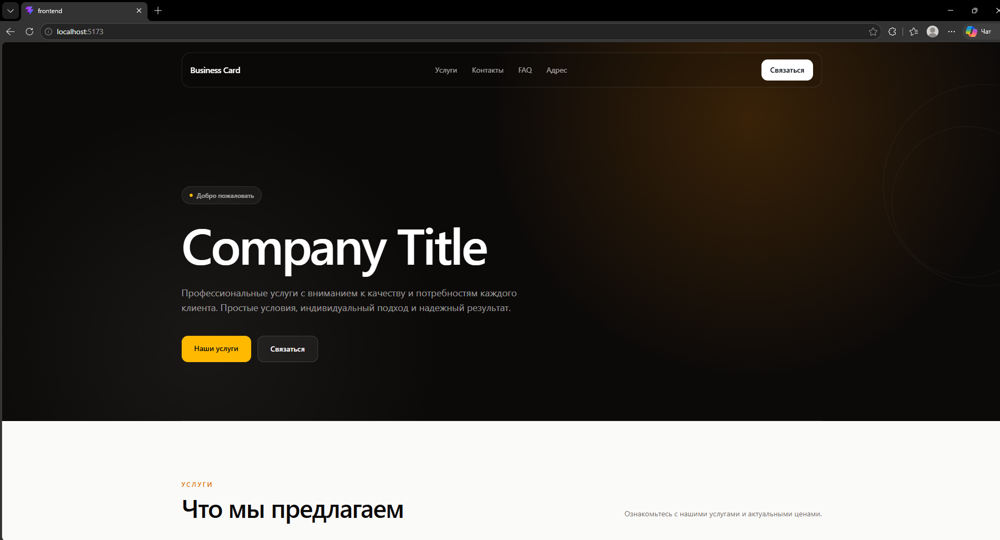
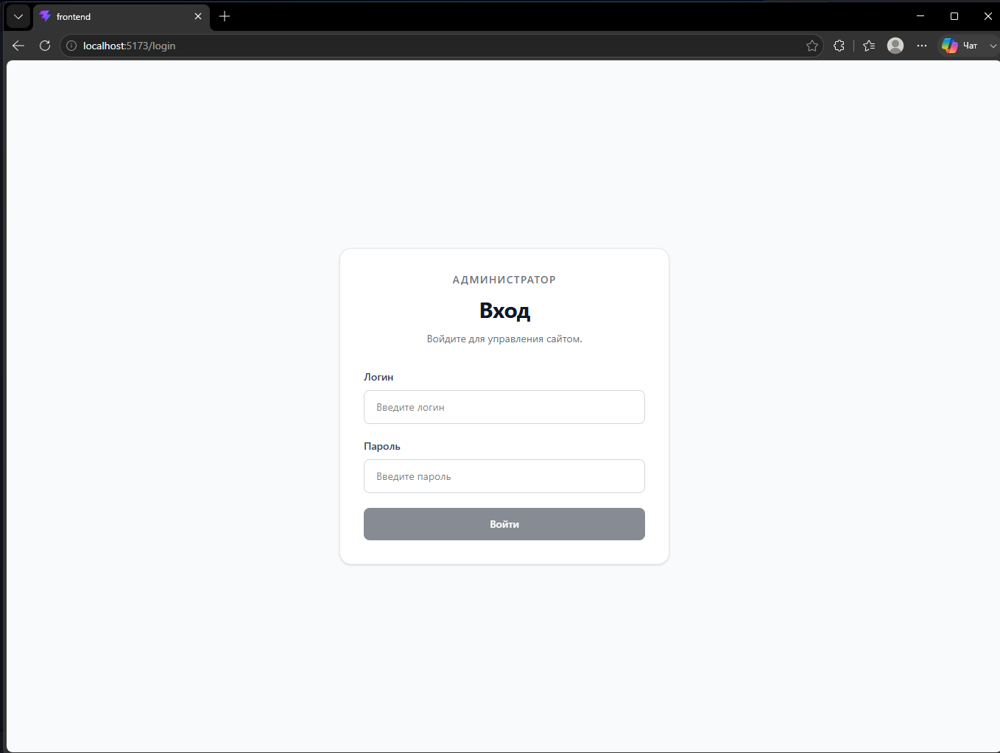
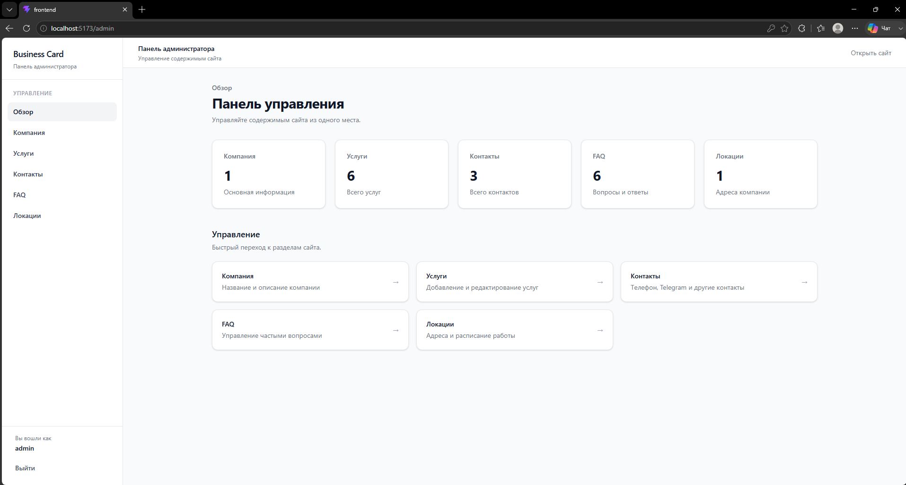
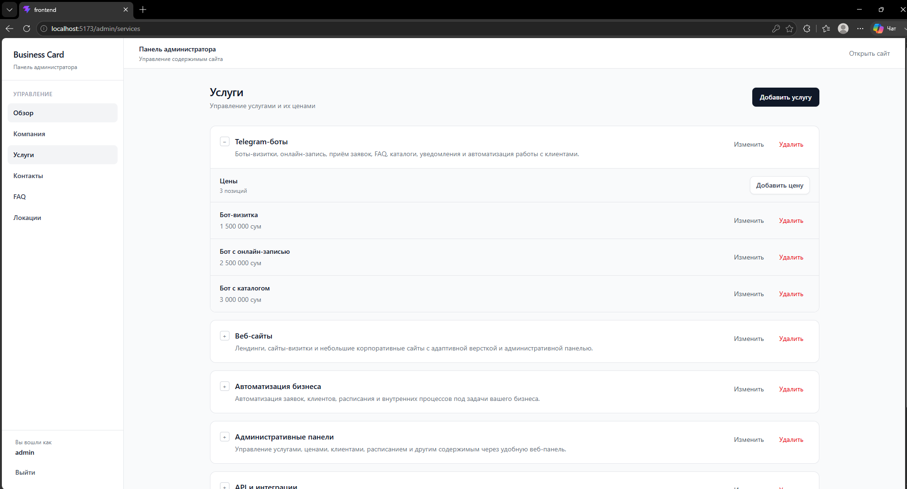

# Business Card Website

[](https://www.python.org/) [](https://fastapi.tiangolo.com/) [](https://vuejs.org/) [](https://www.typescriptlang.org/) [](https://tailwindcss.com/) [](https://www.sqlite.org/) [](https://www.docker.com/) [](#тестирование) [](#архитектура) [](#архитектура) [](#лицензия)

Полноценный веб-сайт-визитка с публичной страницей и административной панелью для управления содержимым.

Проект построен как отдельное frontend-приложение на Vue 3 и асинхронный backend API на FastAPI. Данные хранятся в SQLite, а приложение полностью запускается через Docker Compose.

---

## 🎬 Демонстрация

[](https://youtu.be/pkCPeVwd3wo)

---

## 🖼 Интерфейс

### Публичная часть




### Административная панель




---

## 📑 Содержание

- [✨ Возможности](#-возможности)
- [🛠️ Стек](#️-стек)
- [🏗️ Архитектура](#️-архитектура)
- [🔌 API](#-api)
- [🔐 Аутентификация](#-аутентификация)
- [🗄️ База данных](#️-база-данных)
- [🐳 Docker](#-docker)
- [🚀 Запуск](#-запуск)
- [💻 Запуск без Docker](#-запуск-без-docker)
- [🧪 Тестирование](#-тестирование)
- [📊 Статистика проекта](#-статистика-проекта)
- [📁 Структура проекта](#-структура-проекта)
- [📄 Лицензия](#-лицензия)
- [📬 Контакты](#-контакты)

---

## ✨ Возможности

### Публичная часть

- Информация о компании
- Список услуг
- Контактная информация
- FAQ
- Адреса и расположение
- График работы
- Цены
- Адаптивный интерфейс

### Административная панель

- Авторизация администратора
- Управление информацией о компании
- Управление услугами
- Управление ценами
- Управление контактами
- Управление FAQ
- Управление локациями
- Управление расписанием
- Dashboard
- Защищённые административные API-эндпоинты

### Backend

- REST API
- Асинхронная работа с базой данных
- JWT-аутентификация
- Аутентификация через HTTP cookie
- Хеширование паролей через Argon2
- Валидация данных через Pydantic
- Разделение публичных и административных маршрутов
- Централизованная обработка исключений
- Конфигурация через переменные окружения

### Тестирование

Проект содержит автоматические тесты для:

- публичного API
- административного API
- авторизации
- сервисного слоя
- репозиториев
- security-модуля
- validators

Текущее состояние:

```text
604 passed
0 failed
0 errors
```

---

# 🛠️ Стек

## Backend

* Python 3.13
* FastAPI
* Uvicorn
* Pydantic 2
* Pydantic Settings
* SQLite
* aiosqlite
* PyJWT
* pwdlib
* Argon2
* python-multipart

## Frontend

* Vue 3
* TypeScript
* Vite
* Vue Router
* Pinia
* Tailwind CSS
* vue-tsc

## Testing

* pytest
* pytest-asyncio
* HTTPX

## Infrastructure

* Docker
* Docker Compose
* Nginx

---

# 🏗️ Архитектура

Backend построен с использованием многослойной архитектуры.

```text
HTTP Request
     │
     ▼
   Routes
     │
     ▼
  Schemas
     │
     ▼
  Services
     │
     ▼
Repositories
     │
     ▼
   SQLite
```

Основные принципы:

* Layered Architecture
* Service Layer
* Repository Pattern
* Dependency Injection
* асинхронная работа с I/O
* разделение API, бизнес-логики и доступа к данным

### Backend

```text
backend/
├── api/
│   ├── routes/
│   │   ├── admin/
│   │   ├── auth/
│   │   └── public/
│   ├── schemas/
│   └── dependencies.py
│
├── core/
│   ├── constants.py
│   ├── exception_handlers.py
│   ├── exceptions.py
│   ├── logger.py
│   └── security.py
│
├── database/
│   ├── connection.py
│   ├── init_db.py
│   └── migrations.py
│
├── repositories/
│
├── services/
│
├── tests/
│
├── utils/
│
├── config.py
├── main.py
├── Dockerfile
└── requirements.txt
```

### Frontend

Frontend разделён на API-клиент, composables, stores, components, layouts и views.

```text
frontend/
└── src/
    ├── api/
    ├── assets/
    ├── components/
    │   ├── admin/
    │   ├── auth/
    │   ├── common/
    │   └── public/
    ├── composables/
    ├── layouts/
    ├── router/
    ├── stores/
    ├── types/
    ├── views/
    │   ├── admin/
    │   ├── auth/
    │   └── public/
    ├── App.vue
    └── main.ts
```

---

# 🔌 API

API разделён на три основные группы.

## Public API

Публичные данные:

```text
GET /api/company
GET /api/services
GET /api/contacts
GET /api/faq
GET /api/locations
```

## Authentication API

```text
POST /api/auth/login
GET  /api/auth/me
```

## Admin API

Административные CRUD-операции:

```text
/api/admin/company
/api/admin/services
/api/admin/prices
/api/admin/contacts
/api/admin/faq
/api/admin/locations
/api/admin/schedules
```

Административные маршруты защищены авторизацией.

---

# 🔐 Аутентификация

Для административной панели используется JWT-аутентификация.

Пароль администратора хранится не в открытом виде, а в виде Argon2-хеша.

Основные настройки:

```env
ADMIN_USERNAME=admin
ADMIN_PASSWORD_HASH=...
SECRET_KEY=...
ACCESS_TOKEN_EXPIRE_MINUTES=60
COOKIE_SECURE=false
COOKIE_SAME_SITE=lax
```

После успешной авторизации токен передаётся через cookie.

Для production рекомендуется использовать:

```env
COOKIE_SECURE=true
```

при работе через HTTPS.

---

# 🗄️ База данных

Проект использует SQLite.

Для асинхронного доступа используется:

```text
aiosqlite
```

Основные сущности:

```text
company
services
prices
contacts
faq
locations
schedules
```

В Docker база данных хранится в отдельном named volume:

```text
database
```

Путь внутри backend-контейнера:

```text
/app/data/business_card.db
```

Благодаря Docker volume данные сохраняются после остановки контейнеров.

---

# 🐳 Docker

Проект состоит из двух контейнеров:

```text
┌──────────────────────────────┐
│        Frontend              │
│      Vue + Nginx :80         │
└──────────────┬───────────────┘
               │
               │ /api/
               ▼
┌──────────────────────────────┐
│         Backend              │
│      FastAPI :8000           │
└──────────────┬───────────────┘
               │
               ▼
        SQLite / Volume
```

Frontend-контейнер:

```text
Node 24 Alpine
      ↓
npm run build
      ↓
Nginx Alpine
```

Backend-контейнер:

```text
Python 3.13-slim
      ↓
FastAPI
      ↓
Uvicorn
```

Nginx проксирует запросы:

```text
/api/*
```

на backend:

```text
http://backend:8000
```

---

# 🚀 Запуск

## Требования

Для запуска необходимы:

* Git
* Docker
* Docker Compose

Проверить установку Docker:

```bash
docker --version
docker compose version
```

---

## 1. Клонирование

```bash
git clone https://github.com/idtmt/business-card-website.git
cd business-card-website
```

---

## 2. Создание `.env`

В корне проекта находится файл:

```text
.env.example
```

Создайте на его основе `.env`.

### Windows PowerShell

```powershell
Copy-Item .env.example .env
```

### Linux / macOS

```bash
cp .env.example .env
```

После этого заполните `.env`.

Пример:

```env
DEBUG=false
ADMIN_USERNAME=admin
ADMIN_PASSWORD_HASH=...
SECRET_KEY=...
ACCESS_TOKEN_EXPIRE_MINUTES=60
COOKIE_SECURE=false
COOKIE_SAME_SITE=lax
```

> `.env` содержит секретные данные и не должен добавляться в Git.

---

## 3. Запуск Docker Compose

Выполните:

```bash
docker compose up --build -d
```

После успешного запуска приложение будет доступно:

```text
http://localhost
```

Backend API:

```text
http://localhost:8000
```

---

## 4. Проверка контейнеров

```bash
docker compose ps
```

Ожидается два запущенных сервиса:

```text
backend
frontend
```

---

## 5. Просмотр логов

Все логи:

```bash
docker compose logs
```

Backend:

```bash
docker compose logs backend
```

Frontend:

```bash
docker compose logs frontend
```

Логи в реальном времени:

```bash
docker compose logs -f
```

---

## 6. Остановка

```bash
docker compose down
```

Эта команда остановит и удалит контейнеры, но сохранит Docker volume с базой данных.

---

## 7. Пересборка

После изменения исходного кода или зависимостей:

```bash
docker compose down
docker compose up --build -d
```

Полная пересборка без Docker cache:

```bash
docker compose build --no-cache
docker compose up -d
```

---

## 8. Полное удаление вместе с базой данных

```bash
docker compose down -v
```

> Внимание: `-v` удаляет Docker volume `database` вместе с SQLite-базой.

---

# 💻 Запуск без Docker

## Backend

Создание виртуального окружения:

```bash
python -m venv .venv
```

Активация в Windows PowerShell:

```powershell
.venv\Scripts\Activate.ps1
```

Установка зависимостей:

```bash
pip install -r backend/requirements.txt
```

Создайте `.env`:

```powershell
Copy-Item .env.example .env
```

Запуск:

```bash
uvicorn backend.main:app --reload
```

Backend будет доступен по адресу:

```text
http://localhost:8000
```

---

## Frontend

Перейдите в директорию frontend:

```bash
cd frontend
```

Установите зависимости:

```bash
npm ci
```

Запустите dev-сервер:

```bash
npm run dev
```

Для production-сборки:

```bash
npm run build
```

---

# 🧪 Тестирование

Запуск всех тестов:

```bash
pytest
```

Текущий результат:

```text
604 passed
```

Конфигурация pytest находится в:

```text
pytest.ini
```

Используемые маркеры:

```text
integration
api
service
repository
unit
public
admin
```

---

# 📊 Статистика проекта

```text
Git-tracked files:       165
Python files:             83
Vue components:           33
TypeScript files:         29
Total code:          19,255 lines
Backend Python:      11,977 lines
Frontend:             7,224 lines
Automated tests:         604
Passed:                  604
Failed:                    0
```

---

# 📁 Структура проекта

```text
business_card_website/
│
├── backend/
│   ├── api/
│   │   ├── routes/
│   │   │   ├── admin/
│   │   │   ├── auth/
│   │   │   └── public/
│   │   ├── schemas/
│   │   └── dependencies.py
│   │
│   ├── core/
│   ├── database/
│   ├── repositories/
│   ├── services/
│   ├── tests/
│   ├── utils/
│   │
│   ├── config.py
│   ├── main.py
│   ├── Dockerfile
│   └── requirements.txt
│
├── frontend/
│   ├── src/
│   │   ├── api/
│   │   ├── assets/
│   │   ├── components/
│   │   ├── composables/
│   │   ├── layouts/
│   │   ├── router/
│   │   ├── stores/
│   │   ├── types/
│   │   └── views/
│   │
│   ├── index.html
│   ├── nginx.conf
│   ├── package.json
│   ├── package-lock.json
│   ├── vite.config.ts
│   ├── Dockerfile
│   └── tsconfig*.json
│
├── .dockerignore
├── .env.example
├── .gitignore
├── compose.yaml
└── pytest.ini
```

---

# 📄 Лицензия

Проект распространяется под лицензией **MIT**.

Полный текст лицензии находится в файле [LICENSE](LICENSE).

---

# 📬 Контакты

Telegram: [@idtmt](https://t.me/idtmt)